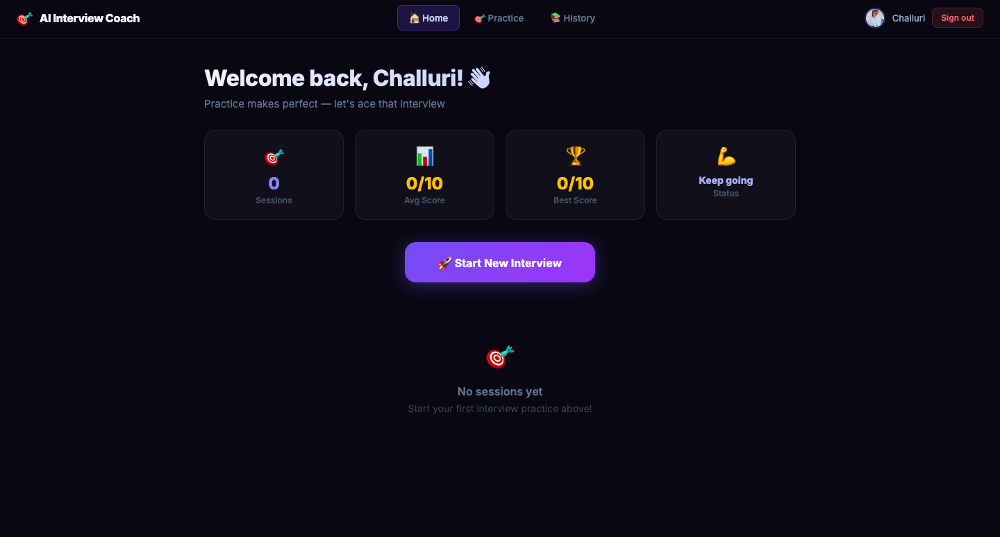
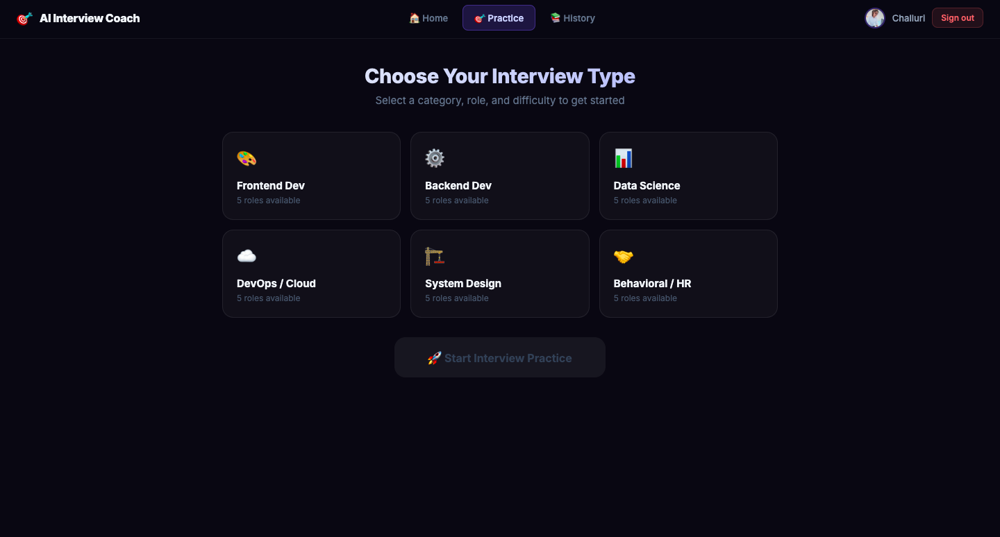
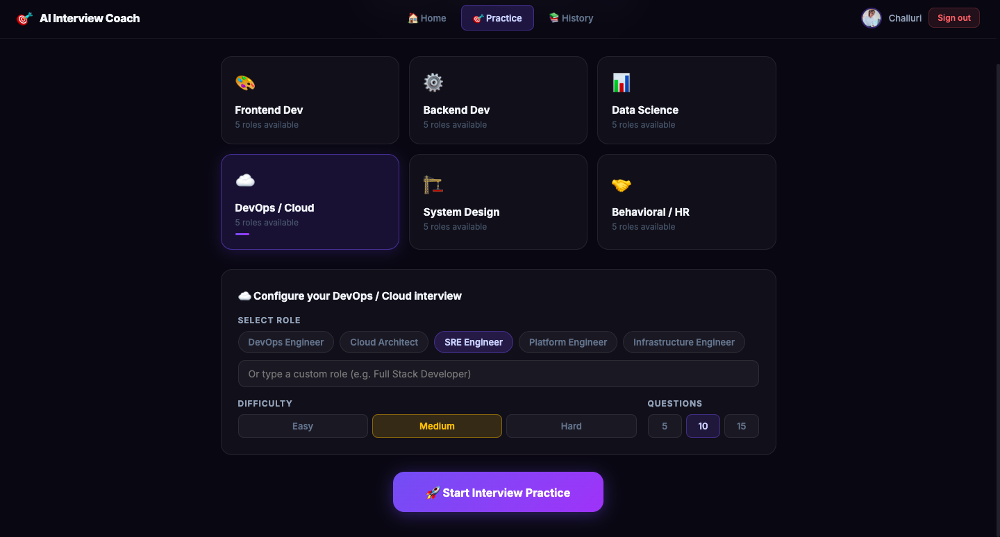
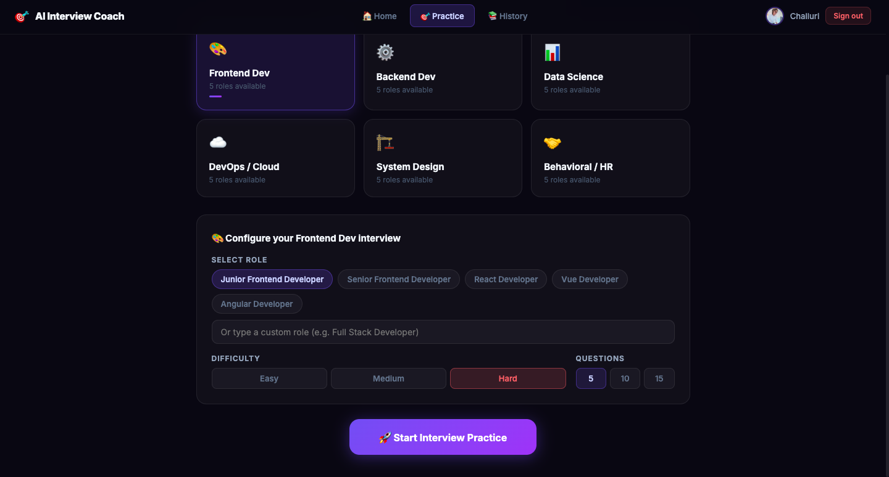
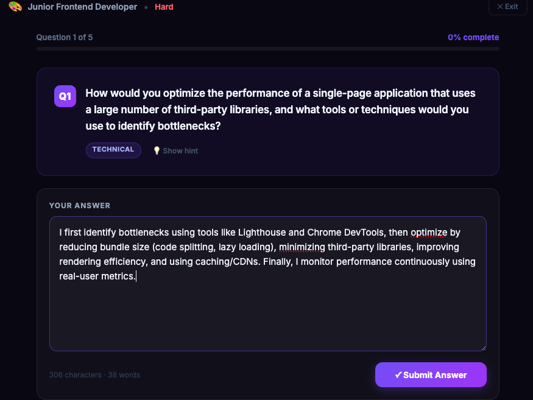
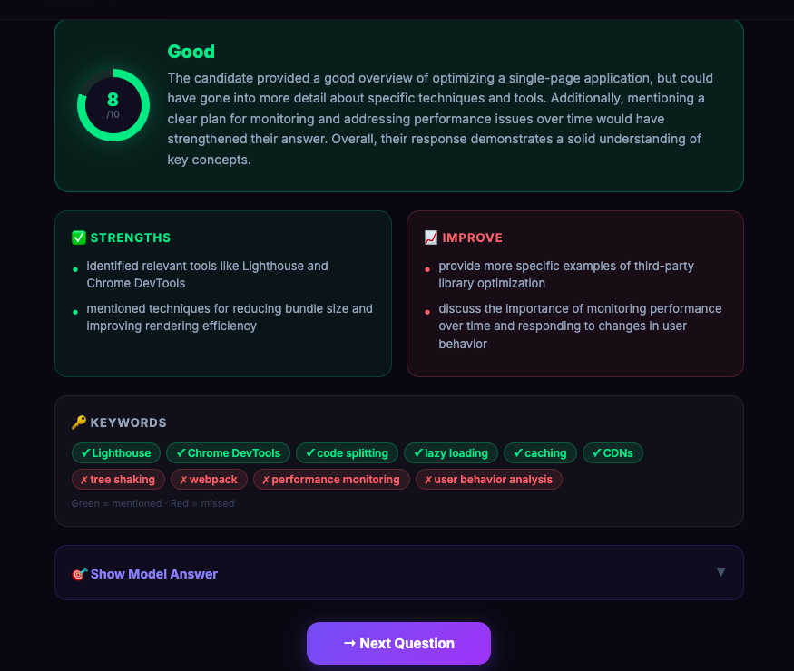

<div align="center">


<br/>

<p align="center">
  <strong>Practice interviews with AI across 6 categories — get instant scoring, keyword analysis, model answers, and PDF session reports.</strong>
</p>

<p align="center">
  <a href="https://ai-interview-coach-roan.vercel.app/">
    
  </a>
  &nbsp;
  <a href="https://github.com/srujanachalluri/ai-interview-coach">
    
  </a>
  &nbsp;
  <a href="https://github.com/srujanachalluri/ai-interview-coach/fork">
    
  </a>
</p>

<p align="center">
  
  
  
  
  
  
</p>

<br/>

<!-- Replace this with your actual screenshot after deployment -->


<br/>



<br/>


<br>



</div>

---

## ✨ Features

<table>
<tr>
<td width="50%">

### 🤖 AI-Powered Practice

- Generates **real interview questions** using Groq + Llama 3
- Covers **6 categories** — Frontend, Backend, Data Science, DevOps, System Design, Behavioral
- Choose **Easy / Medium / Hard** difficulty
- Pick **5, 10, or 15 questions** per session

</td>
<td width="50%">

### 📊 Instant Feedback

- Each answer scored **1 to 10** with detailed feedback
- Shows **strengths** and **areas to improve**
- **Keyword analysis** — what you mentioned vs missed
- **Model answer** revealed after every question

</td>
</tr>
<tr>
<td width="50%">

### 🏆 Session Summary

- Overall score with **performance level**
- Personalized **study topic recommendations**
- Actionable **next steps** before a real interview
- **Download full PDF report** of the session

</td>
<td width="50%">

### 🔥 Firebase Integration

- Google sign-in with one click
- All sessions **saved automatically**
- **History dashboard** with scores over time
- Load and review any past session anytime

</td>
</tr>
</table>

---

## 🏗️ Architecture

```
┌─────────────────────┐         ┌──────────────────────┐
│   React + Vite      │──API──▶ │   Python FastAPI      │
│   (Vercel)          │         │   (Render.com)        │
└─────────────────────┘         └──────────┬───────────┘
         │                                  │
         │                                  ▼
         │                       ┌──────────────────────┐
         │                       │   Groq AI (Free)      │
         │                       │   Llama 3.3 70B       │
         │                       └──────────────────────┘
         ▼
┌─────────────────────┐
│  Firebase           │
│  Auth + Firestore   │
└─────────────────────┘
```

---

## 🛠️ Tech Stack

| Layer                | Technology              | Purpose                                 |
| -------------------- | ----------------------- | --------------------------------------- |
| **Frontend**         | React 18 + Vite         | UI, routing, state management           |
| **Backend**          | Python + FastAPI        | API routes, AI orchestration            |
| **AI**               | Groq + Llama 3.3 70B    | Question generation & answer evaluation |
| **Auth**             | Firebase Authentication | Google sign-in                          |
| **Database**         | Firebase Firestore      | Session history storage                 |
| **Frontend Hosting** | Vercel                  | Free, auto-deploy on push               |
| **Backend Hosting**  | Render.com              | Free Python hosting                     |

---

## 🚀 Quick Start

### Prerequisites

- Node.js 16+
- Python 3.11+
- Firebase project
- Free Groq API key → [console.groq.com](https://console.groq.com)

### 1. Clone

```bash
git clone https://github.com/srujanachalluri/ai-interview-coach.git
cd ai-interview-coach
```

### 2. Backend

```bash
cd backend
python -m venv venv
source venv/bin/activate      # Windows: venv\Scripts\activate
pip install -r requirements.txt
cp .env.example .env          # Add your GROQ_API_KEY
uvicorn main:app --reload
```

→ Runs at **http://localhost:8000** | API docs at **http://localhost:8000/docs**

### 3. Frontend

```bash
cd frontend
npm install
cp .env.example .env          # Add Firebase values + VITE_API_URL=http://localhost:8000
npm run dev
```

→ Runs at **http://localhost:5173**

---

## 🌐 Deployment

### Backend → Render.com (Free)

| Setting        | Value                                          |
| -------------- | ---------------------------------------------- |
| Root Directory | `backend`                                      |
| Build Command  | `pip install -r requirements.txt`              |
| Start Command  | `uvicorn main:app --host 0.0.0.0 --port $PORT` |
| Python Version | `3.11.0`                                       |
| Env Variable   | `GROQ_API_KEY=your_key`                        |

### Frontend → Vercel (Free)

| Setting        | Value                                                                              |
| -------------- | ---------------------------------------------------------------------------------- |
| Root Directory | `frontend`                                                                         |
| Framework      | Vite                                                                               |
| Env Variables  | All `VITE_FIREBASE_*` values + `VITE_API_URL=https://your-render-url.onrender.com` |

---

## 📁 Project Structure

```
ai-interview-coach/
├── backend/
│   ├── main.py              # FastAPI routes
│   ├── gemini.py            # Groq AI logic
│   ├── requirements.txt
│   ├── .python-version      # Pins Python 3.11 for Render
│   └── render.yaml
└── frontend/
    ├── src/
    │   ├── components/
    │   │   ├── Auth/Login.jsx
    │   │   ├── Dashboard/Dashboard.jsx
    │   │   ├── Interview/
    │   │   │   ├── RoleSelector.jsx
    │   │   │   ├── QuestionCard.jsx
    │   │   │   ├── Feedback.jsx
    │   │   │   └── SessionSummary.jsx
    │   │   └── History/History.jsx
    │   ├── api.js
    │   ├── firebase.js
    │   ├── App.jsx
    │   └── main.jsx
    ├── .env.example
    └── package.json
```

---

## 🔑 Environment Variables

### `backend/.env`

```env
GROQ_API_KEY=gsk_your_groq_api_key_here
```

### `frontend/.env`

```env
VITE_FIREBASE_API_KEY=
VITE_FIREBASE_AUTH_DOMAIN=
VITE_FIREBASE_PROJECT_ID=
VITE_FIREBASE_STORAGE_BUCKET=
VITE_FIREBASE_MESSAGING_SENDER_ID=
VITE_FIREBASE_APP_ID=
VITE_API_URL=http://localhost:8000
```

---

## 🗺️ API Endpoints

| Method | Endpoint          | Description                    |
| ------ | ----------------- | ------------------------------ |
| `GET`  | `/`               | API status check               |
| `GET`  | `/health`         | Health check                   |
| `GET`  | `/api/categories` | Get all 6 interview categories |
| `POST` | `/api/questions`  | Generate interview questions   |
| `POST` | `/api/evaluate`   | Evaluate a candidate's answer  |
| `POST` | `/api/summary`    | Generate session summary       |

Full interactive docs → `/docs`

---

## ⭐ Star History

[](https://star-history.com/#srujanachalluri/ai-interview-coach&Date)

---

## ☕ Support

<div align="center">

If this project helped you land a job or learn something new, consider supporting it!

[](https://www.buymeacoffee.com/srujanachalluri)

<br/>

**⭐ Star this repo — it helps others find it and motivates continued development!**

[](https://github.com/srujanachalluri/ai-interview-coach/stargazers)
&nbsp;&nbsp;
[](https://github.com/srujanachalluri/ai-interview-coach/network/members)

</div>

---

## 👩‍💻 Author

<div align="center">

**Srujana Challuri** — Software Engineer

[](https://github.com/srujanachalluri)
[](https://master-portfolio-rho.vercel.app/)
[](https://linkedin.com/in/srujanachalluri)

</div>

---

## 📄 License

MIT License — free to use for learning or your own portfolio.

---

<div align="center">
  <sub>Built with ❤️ using React · FastAPI · Groq AI · Firebase</sub>
</div>
